# GPS World Clock

While most phones have the ability to display the local time throughout the world, you may not always have access to an internet connection. With our World Clock, all you need is a GPS signal.

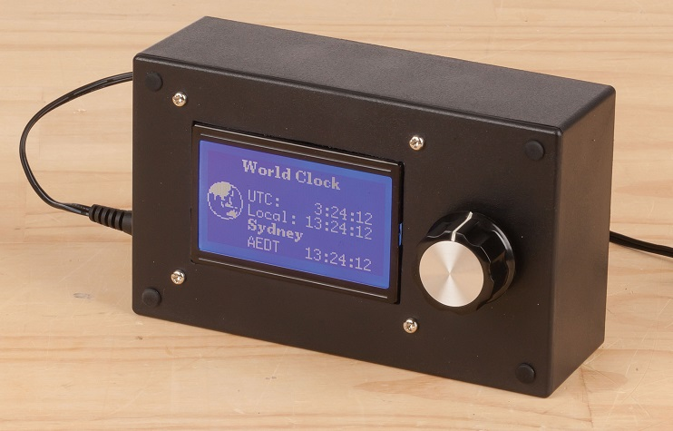

- [GPS World Clock](#GPS-World-Clock)
  - [Bill of Materials](#Bill-of-Materials)
    - [Optional Extras](#Optional-Extras)
  - [Connection Table](#Connection-Table)
  - [Software Libraries](#Software-Libraries)
  - [Assembly](#Assembly)
  - [Programming](#Programming)
  - [Use](#Use)

## Bill of Materials

| Qty | Code                                    | Description                     |
| --- | --------------------------------------- | ------------------------------- |
| 1   | [SR1230](http://jaycar.com.au/p/SR1230) | Rotary encoder with push button |
| 1   | [XC4617](http://jaycar.com.au/p/XC4617) | LCD Dot matrix module           |
| 1   | [XC4420](http://jaycar.com.au/p/XC4420) | Arduino Mega board              |
| 1   | [XC3712](http://jaycar.com.au/p/XC3712) | GPS Receiver                    |
| 1   | [WC6028](http://jaycar.com.au/p/WC6028) | jumper leads plug to socket     |
| 1   | [HP0406](http://jaycar.com.au/p/HP0406) | M3 Bolts                        |
| 1   | [HP0425](http://jaycar.com.au/p/HP0425) | M3 Nuts                         |
| 1   | [HP0148](http://jaycar.com.au/p/HP0148) | M3 Nylon Washers                |
| 1   | [HB6011](http://jaycar.com.au/p/HB6011) | Jiffy box enclosure             |
| 1   | [RC5360](http://jaycar.com.au/p/RC5360) | Ceramic cap, 100nF              |

### Optional Extras

- DC socket to run it from a power supply, such as [PS0522](http://jaycar.com.au/p/PS0522)

## Connection Table

| MEGA | Type            | Component      |
| ---- | --------------- | -------------- |
| 21   | INPUT INTERRUPT | Encoder A      |
| 19   | INPUT INTERRUPT | Encoder B      |
| 18   | INPUT INTERRUPT | Encoder Button |
| 51   | SPI MOSI        | LCD R/W        |
| 52   | SPI CLK         | LCD E          |
| 53   | SPI CS          | LCD RS         |
| 17   | SERIAL2 RX      | GPS TX         |

You can see the connections below.

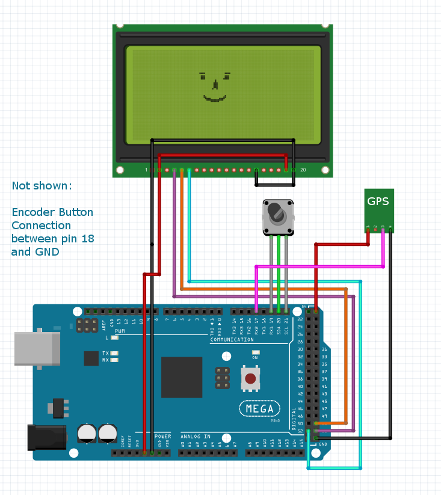

## Software Libraries

| Library | Author     | Version |
| ------- | ---------- | ------- |
| u8g2    | oliver     | 2.24.3  |
| NeoGPS  | SlashDevin | 4.2.9   |

## Assembly

_We have provided a cutout file for both of our projects this month, so feel free to print out (or, if you're very nice, you can ask the store to print out for you) a cutout sheet, and use some cheap glue to keep the paper in place while you drill and cut into the Jiffy enclosures. This will help get the sizes just right._

[cutout.pdf](drawing/cutout.pdf)

There's not a lot of work for this project, the main concerns are related to cutting out the jiffy box. Use the cut-outs to help get the sizes just right, then drill out the corners and slide in either some sort of band-saw or nibbler.

While we haven't used it, we've heard post-humorously that the [TH1768](https://jaycar.com.au/p/TH1768) is great for this, and we'll be trying it next time we're modifying a Jiffy box.

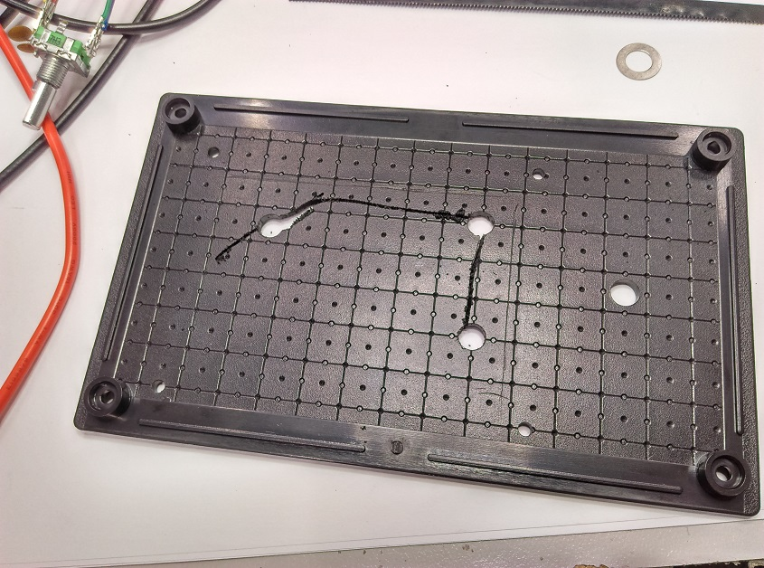

Position where you want, We've opted to have the mega and GPS in the enclosure, with the screen and encoder mounted on the front panel, as shown.

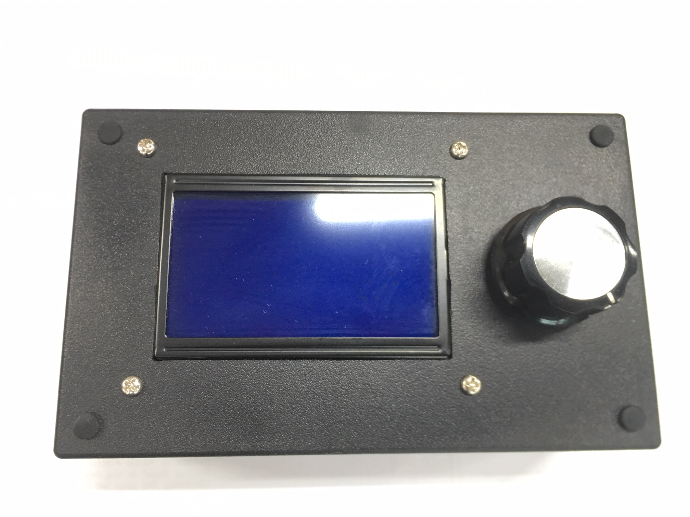

The GPS is mounted face down so we don't have to change the pins, and we just use the jumper leads to connect the modules to each other. At this point you'd probably want to drill out the 3mm holes and use some nuts and bolts to mount everything to the back of the case. Don't use the washers under the mega or GPS, as you'll need to use them for mounting the LCD panel. You could use some hot glue to glue down the GPS antenna.

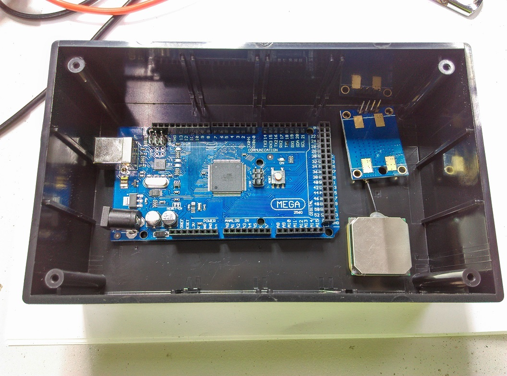

The LCD Panel does need jumper wires connecting 5V to `BLA` and GND to `BLK` as shown; also solder `PSB` to ground so that it is always enabled.

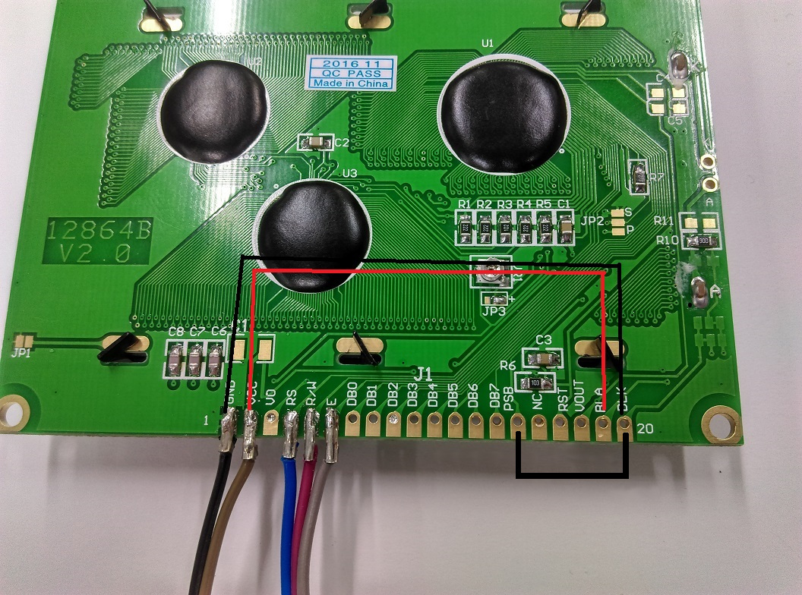

You can use a small pin or screwdriver to get in under the plastic of the sockets for the leads, and easily slide off the plastic.

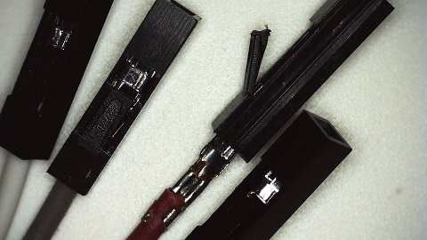

This will make for easy and neat soldering onto other components such as the encoder, and you can snip them to be a suitable size to mount onto the screen.

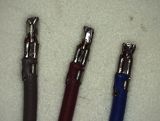

The encoder will need the two capacitors connected to it so that they can absorb the [mechanical bounces](https://www.allaboutcircuits.com/technical-articles/switch-bounce-how-to-deal-with-it/) and makes for a very smooth experience with the encoder. Attach these between pins A-C and B-C on the encoder. You can see the pinout diagram for the encoder below.

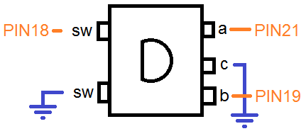

It will be easier if you first put on the sockets from before, then poke in the capacitor legs so that they all fit snug and tight, then apply a small dab of solder to join them all together.

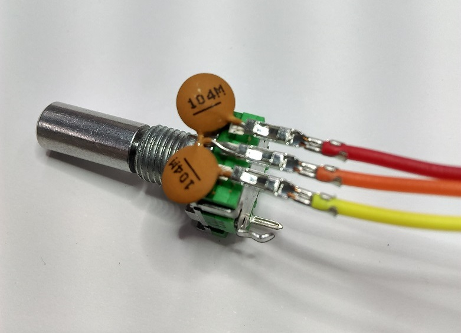

The encoder requires a 10mm hole in the front case.

We've also soldered the DC jack to the DC jack on the MEGA, so that they can use the same regulator and have the reverse polarity protection. If you opt to use the DC Jack, ensure that the center pin is the positive (red) and the outside is negative (brown).

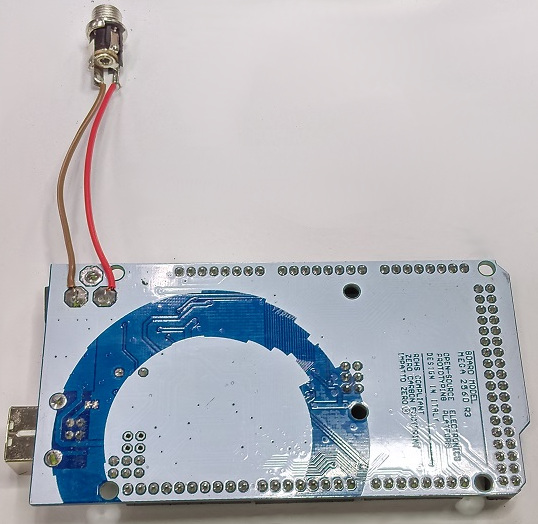

If you don't want to use a DC Jack, you can simply cut out a square hole for the MEGA's USB Connection.

We opted not to include the Knob for this project, as we'll allow you to choose whatever you want. The knob in the picture is [HK7742](https://jaycar.com.au/p/HK7742). But we have other styles and sizes for you to choose.

## Programming

- We're using pin interrupts on 19 and 21 to calculate the rotary encoder values by counting the number of turns since we last processed it. This allows for a very fluid response on the screen, even with lag or time delays.

```cpp
//change to PIN_A for opposite direction
attachInterrupt(digitalPinToInterrupt(PIN_B),
                isr_enc,CHANGE);

void isr_enc(){ //interrupt service routine
  if(digitalRead(PIN_A) == digitalRead(PIN_B))
    enc_value++;
  else
    enc_value--;
}
```

- We've defined a `LOCAL_TIME` constant for you to set in the code for a simple localtime adjustment

```cpp
#define LOCAL_HOURS 10
#define LOCAL_MINUTES 0
```

- We also create our own struct to hold Timezone information, such as the name, code, GPS-coords, and adjustments.

```cpp
struct tzinfo {
  const char* name;
  const char* tz;
  long latmin; long latmax; //GPS coords
  long lonmin; long lonmax;
  short hours; //adjustments
};

/*
because an hour adjustment can only be up to 12,
which is the first nibble of a byte, we can use the other
nibble to act as flags for parameters such as
HALF, DST, or negative times
*/
#define TZ_HALF   0b10000000
#define TZ_NEG    0b01000000
#define TZ_DST    0b00100000

struct tzinfo tz_list[] = {
  {"Brisbane", "AEST",
    -25900761,-28120489,
    137913970,153451528,
    10},

  {"Sydney", "AEDT",
    -25900761,-28120489,
    137913970,153451528,
    10 | TZ_DST},

  {"Adelaide", "ACDT",
    -25900761,-28120489,
    137913970,153451528,
    9 | TZ_DST | TZ_HALF },
};
```

## Use

Once the code is uploaded it should be easy enough to use, it will find the GPS and UTC time, and automatically apply a +10 timezone conversion to it. `LOCAL_TIME` is configured in the code, and the selected timezone is selected through the menu system, by pressing on the encoder wheel.

If time is not changing, try taking it close to a window so that it can get a better lock on the GPS signal. You should be able to see some output on the Serial Monitor if you connect it to your computer. if you see a lot of empty fields (`,,,,,`) then you might have a problem getting a GPS signal.
